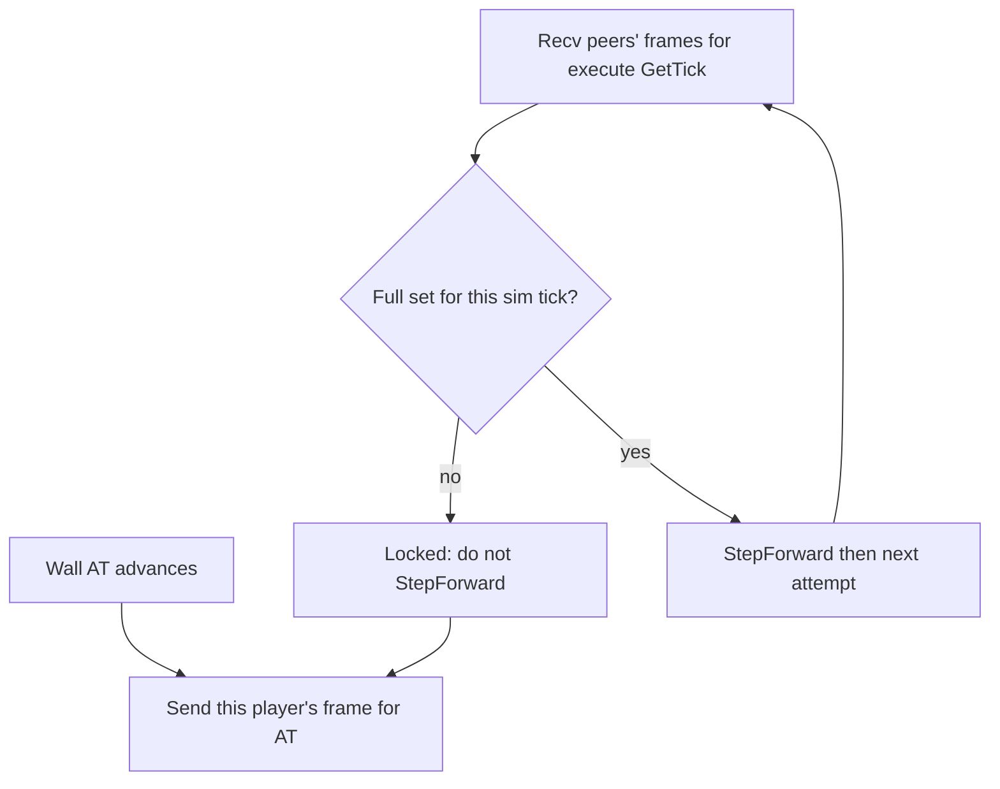

# Altruistic Locking

Living lockstep contract. Not implemented yet (today is optimistic FTD: tick anyway, detect desync). When wait-for-all lands, this is how a stall must behave.

Related: [`wall_clock_pacer.plan.md`](wall_clock_pacer.plan.md) (attempt vs `StepForward`), [`optimistic_scheduled_orders.plan.md`](optimistic_scheduled_orders.plan.md) (AT vs `GetTick()`, FTD), [`immediate_sends.plan.md`](immediate_sends.plan.md) (click must not wait for the pacer), [`networking.plan.md`](networking.plan.md) (empty frames), [`gameplay_state_hash.plan.md`](gameplay_state_hash.plan.md) (detect, does not lock).

## Definitions

**Actual Tick (AT)** — wall lattice from Kickoff `T0`: `floor((now - T0) * tps)`. Independent of the sim. Already in [`USimRTSRoom::GetActualTick()`](../SimRTS/Source/SimRTS/Room/SimRTSRoom.cpp).

**Sim tick** — `TickEngine::GetTick()`. Advances only after a committed `StepForward`.

**Locked client** — a client that has **not received all necessary command frames** (orders or empty) for the **current sim tick**. It must not `StepForward`. Wall time is not locked; AT keeps moving.

Altruistic Locking: that client **still emits AT-cadence frames** so the rest of the room can simulate. The send is for the room. The locked player is the one who suffers (stale world, `GetTick()` ≪ AT, poor decisions).

## Two clocks

| Clock | Follows | When locked |
|---|---|---|
| Send | AT (wall) | Keep emitting: empty frame, or orders stamped with current AT. Execute tick stays `AT + FTD`. |
| Simulate | Lock (`GetTick()`) | No-op the pacer attempt until the current execute tick is complete. Then zoom catch-up. |

Do not key send off `GetTick()`. If send stops because the sim stalled, other wait-for-all clients treat silence as “frame not arrived” and **they** stall too. One missing receive becomes a room-wide freeze.

Tick 2001 cannot run until tick 2000 has been simulated (causality). That is one queue, not a new lock per tick. While stalled, later AT frames can already sit in the scheduled cache. When 2000 completes, zoom through 2001, 2002, … ([`wall_clock_pacer.plan.md`](wall_clock_pacer.plan.md)).

## Why “altruistic”

The locked client does not catch up by sending. They catch up when **other people’s** missing frames arrive. Sending anyway:

- Lets peers who already have a full set keep `StepForward`.
- Prevents “I am behind, so I go quiet” from locking everyone who needs **this** player’s empty/order frame for current execute ticks.
- Leaves the locked player looking at an old `BattleState`. Clicks still execute on the real future tick. That is their cost.

## Empty frames

Without a per-player, per-AT frame that may be empty, “no orders” and “locked and mute” are the same on the wire. Altruistic Locking requires empty frames (heartbeats). Hashes on click-only packets cannot substitute: a locked client with no clicks would send nothing.

Self-bounce of those frames is still ignored for hash compare; the frame itself must still exist so wait-for-all can complete.

## Out of scope here

- Implementing wait-for-all or empty UDP frames (still absent).
- Late join / snapshot.
- Resend / reliability.
- Changing FTD or the pacer formula.
- Using hashes as a lock (they detect; they do not stall `StepForward`).
