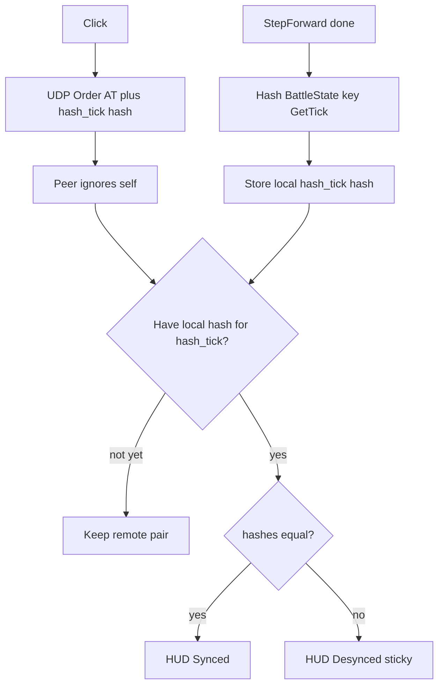

# Gameplay state hash (desync detect)

The (tick, hash) pair idea is right. Three corrections so LAN does not false-red:

**1. Hash sim `GetTick()`, never Actual Tick.** AT is for scheduling. The hash describes committed sim state after a `StepForward`. The packet already has `actual_tick`; add a second pair `hash_tick` + `state_hash`.

**2. Do not hash the scheduled-command cache.** An in-flight order is in A’s cache and not yet in B’s. Same sim tick, different cache → false desync. Hash only `BattleState` (units + live waypoint `orders`). Pathfind at Scheduled Tick is already in `BattleState` on both machines once that tick has run.

**3. Do not hash `Unit.rotation`.** Yaw still uses `atan2`/`double` ([`TickEngine.cpp`](../SimRTS/Source/RTSEngine/Private/TickEngine.cpp) `UpdateRotationToward`). That is visual, not lockstep-safe.

Hash **after** each `StepForward` (including `++tick_`), key = `GetTick()`. Also record tick 0 at level load. Same point on every client.

Hashes travel **on order packets only** (no empty frames this slice). Each client still **computes and stores** a hash every sim tick so a late peer can compare. Self-bounce is ignored (`sim_player_id` == local). Solo room stays green (nothing to disagree).

## What goes in the hash

The number itself is [`TickEngine::GameplayHash()`](../SimRTS/Source/RTSEngine/Public/TickEngine.h). How it is mixed (FNV-1a, little-endian fields, include/exclude, how to extend it) is [`gameplay_hash.plan.md`](gameplay_hash.plan.md). Do not treat that recipe as obvious when adding lockstep fields.

## Wire + history

[`CommsOrder`](../SimRTS/Source/RTSComms/Public/CommsTypes.h): `hash_tick` (int32), `state_hash` (uint64). Encode after existing fields. Server still opaque.

[`ASimRTSGameMode`](../SimRTS/Source/SimRTS/Framework/SimRTSGameMode.cpp): on send, attach latest local pair. On bounce from others, compare or queue. Ring of last ~600 local hashes (~20s at 30 tps). Sticky `bDesynced`. Remote pair older than the window: ignore.

[`USimRTSRoom::OnSimTick`](../SimRTS/Source/SimRTS/Room/SimRTSRoom.cpp): after `StepForward`, record hash. Tick 0 at `LoadDefault`.

## HUD

One line: **Synced** green, **Desynced** red (stays red). No comparison yet: **Synced** (or `--` only if you prefer unknown; default green).

[`Project.md`](../Project.md): hash is sim tick + committed `BattleState`; not AT; not scheduled cache.

Out of scope: empty checksum heartbeats, recovery, hashing rotation, wait-for-all.
