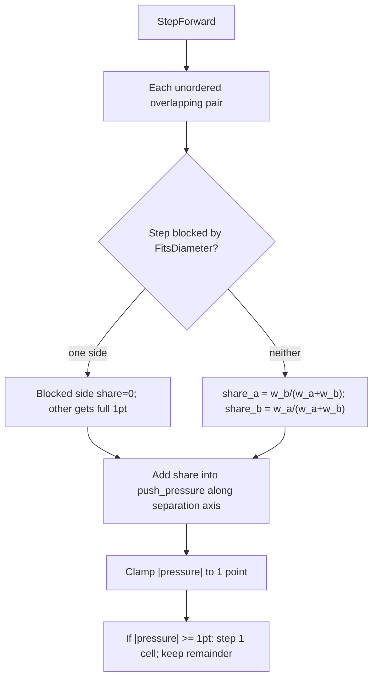

# Idle push-out (weighted pressure)

## Problem

Even with sparse goals, units can finish on overlapping discs. Full 1-point nudges by ascending id let a light unit shove a tank and let one mover peel an entire crowd. Need mass-aware separation on the integer grid without floating positions.

## Approach

Run `ApplyIdlePush` once per `StepForward`, after movement and the second `ApplyOrders` pass:

```text
ApplyOrders → AdvanceMovement → ApplyOrders → ApplyIdlePush → tick++
```

Only idle units with `UnitDef.idle_push` **receive** pressure and may step. Any unit can be an overlap peer (moving peers still contribute weight).



## Rules

- **Overlap**: `4 * (dx² + dy²) < (diameter_a + diameter_b)²`
- **Pair budget**: each overlapping pair contributes **1 point** of separation per tick (split, not doubled)
- **Weight split** (both sides free): lighter unit takes the larger share  
  `share_self = weight_other / (weight_self + weight_other)`
- **Wall / edge**: if the separation step fails `FitsDiameter` (or is zero), that side is **infinite mass** → peer receives 100% of the point; blocked side gets 0
- **Both blocked**: no shares this pair
- **Pressure**: fixed-point `kPushPressureScale = 1024` ≡ 1 grid point; stored on `Unit.push_pressure_x/y`; clamped to ±1 point so residual carries across ticks without float space
- **Step**: when `|pressure|` on an axis reaches 1 point, move 1 cell on the dominant axis and subtract 1 point; at most one step per unit per tick
- **BeginMove**: clears pressure so pathing is not fighting leftover push
- **Determinism**: pairs and apply order by ascending unit id; integer mul/div only for shares

## Defaults

| Type | weight |
|------|--------|
| Soldier | 1 |
| Vehicle | 100 |

Examples: soldier vs soldier → ½ point each per tick (step after 2 ticks). Soldier vs vehicle → soldier ≈ 100/101, vehicle ≈ 1/101.

## Flags / data

- [`UnitDef.h`](SimRTS/Source/RTSEngine/Public/UnitDef.h): `bool idle_push = true`, `int32_t weight = 1`
- [`Unit.h`](SimRTS/Source/RTSEngine/Public/Unit.h): `push_pressure_x`, `push_pressure_y`
- [`GameRules.json`](SimRTS/Content/Data/GameRules.json): optional `"idle_push"`, optional `"weight"` (positive int; default 1 if omitted)

## Files

- Edit: [`TickEngine.cpp`](SimRTS/Source/RTSEngine/Private/TickEngine.cpp) — weighted `ApplyIdlePush`
- Edit: [`UnitDef.h`](SimRTS/Source/RTSEngine/Public/UnitDef.h), [`Unit.h`](SimRTS/Source/RTSEngine/Public/Unit.h), [`LevelLoader.cpp`](SimRTS/Source/SimRTS/Level/LevelLoader.cpp)
- Relies on: [`PathingClearance`](SimRTS/Source/RTSEngine/Public/PathingClearance.h) `FitsDiameter`

## Relationship to sparse goals

- Sparse places goals without wall checks so groups can clump beside large obstacles.
- Idle push is the post-arrival spreader; pathfinding still builds segments outside obstructions.
- Pressure (not mid-move push) is what separates stacked arrivals near walls.

## Verify

- Two equal-weight stacked soldiers separate within a few ticks
- Soldier vs vehicle: soldier steps within ~2–3 ticks; vehicle still at start
- Blocked clearance → that unit keeps pressure / peer takes full share when only one side is free
- `idle_push: false` → unit never receives pressure (may still be a weighted peer)
