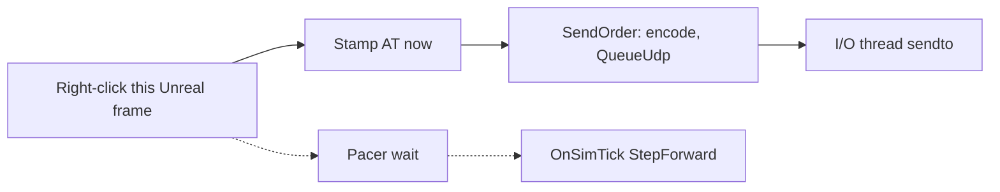

# Immediate Sends

Living lockstep contract. Already how clicks work today. Keep it when wait-for-all, empty frames, or altruistic locking land.

Related: [`wall_clock_pacer.plan.md`](wall_clock_pacer.plan.md) (wait is only for the next **sim attempt**), [`optimistic_scheduled_orders.plan.md`](optimistic_scheduled_orders.plan.md) (send on click, apply on bounce), [`altruistic_locking.plan.md`](altruistic_locking.plan.md) (send follows the wall).

## Rule

**The pacer must not impede clicks reaching communication.** `SetTimer` until `T0 + N/tps` only delays `StepForward`. Input, `GetActualTick()`, encode, and `SendOrder` run on the Unreal frame that got the click — including in the middle of a pacer wait.

Holding a packet until the next sim tick would add up to one interval (~33 ms at 30 tps). Immediate Sends **earns** that time: stamp AT at click, put the datagram on the I/O thread at once. FTD still delays **activation**, not send. `mock_tick_lag` was the opposite (delay send) and is gone.

Path today: [`UOrderManager::HandleRightClick`](../SimRTS/Source/SimRTS/Selection/OrderManager.cpp) → [`ASimRTSGameMode::SubmitMoveOrder`](../SimRTS/Source/SimRTS/Framework/SimRTSGameMode.cpp) → [`CommsClient::SendOrder`](../SimRTS/Source/RTSComms/Private/CommsClient.cpp). [`USimRTSRoom::OnSimTick`](../SimRTS/Source/SimRTS/Room/SimRTSRoom.cpp) does not flush clicks.

## Avoid

Do not add anything whose job is to **wait before the packet can leave**:

| Delay | Why not |
|---|---|
| Buffer until `OnSimTick` / next pacer attempt | Re-introduces send lag the pacer must not own. |
| Batch / coalesce several clicks into one datagram at a tick boundary | Same; also reorders AT stamps. Empty-frame **cadence** (later) is a different knob — not click coalescing. |
| Game-thread lock on `recv` / `sendto` / Login | SimRTS stays block-free. Public comms API returns at once. |
| Wait for a full lockstep set before sending **this** player’s click | That is receive-side lock. Send stays altruistic and immediate. |
| A second delay queue (`mock_tick_lag`, “send next tick”) | FTD is the only scheduling delay. |

Allowed: a **short** mutex to push one already-encoded datagram onto the I/O out-queue so the game thread never blocks on the socket. That is a handoff, not a tick batch. The worker must drain it as soon as it can (today: `UdpLoop` `DrainUdpOut`; recv timeout is 50 ms — do not make that worse, and do not wait on the pacer).

`PumpComms` / `TryPop` every Unreal frame is for **inbound** bounce → scheduled cache. It is not a send buffer.

## Two clocks (same split)

| | Immediate Sends | Pacer / lock |
|---|---|---|
| When | Click (or empty-frame AT cadence later) | Next sim **attempt** |
| What | UDP Order on the wire, AT stamped now | `StepForward` when allowed |
| Must not | Wait for `GetTick()` or the timer | Send or block input |

Clock not started, room not loaded, or not in a relay room → do not send (already). That is eligibility, not batching.

## Out of scope here

- Changing FTD, pacer formula, or recv timeout.
- Implementing empty frames (cadence may be slower than tps; clicks stay immediate).
- Wait-for-all / altruistic locking implementation.
- Pathfind at click time (still Scheduled Tick).
