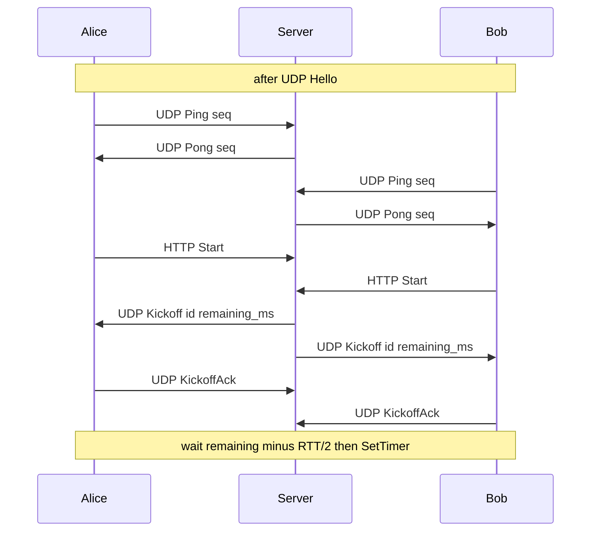

# Kickoff and RTT

Span Server + Comms + SimRTS. `TickEngine` / `OnSimTick` / `StepForward` stay unchanged. Only **when** the Unreal sim timer is armed changes. Late join, lockstep orders, and ongoing tick catch-up are out.

## 1. UDP RTT sampler (lasting tool)

New STL class in RTSComms (e.g. [`RttSampler`](../SimRTS/Source/RTSComms/Public/RttSampler.h)), owned by [`CommsClient`](../SimRTS/Source/RTSComms/Public/CommsClient.h). Not a UObject, not in RTSEngine.

- Same UDP port as Hello/Order (`udp_port`). **Echo to sender only** — never `RelayAddrs`.
- I/O thread stamps send and Pong. Game thread only reads `MinRttMs()` (mutex/atomic). Do not `TryPop` each ping.
- Ping body: incrementing `seq`. Server Pong echoes `seq`. Match to `send_time[seq]`; ignore unknown/late seq.
- Start pinging after successful Join (UDP Hello acked). Stop on Leave/Stop.
- RTT = **minimum** of the last `ping_keep_amount` completed samples. No sample yet → HUD shows `--` / getter returns -1.
- Window should be a few seconds (`ping_interval_ms` × `ping_keep_amount`), not a long-lived average.

## 2. Networking.json

Required new fields in [`Networking.json`](../SimRTS/Content/Data/Networking.json) and [`NetworkingLoader`](../SimRTS/Source/SimRTS/Level/NetworkingLoader.h):

- `ping_interval_ms` (e.g. 200)
- `ping_keep_amount` (e.g. 10)

Kickoff timing comes from the packet. Server uses Go constants: `kickoff_duration_ms = 1000`, `kickoff_repeat_interval_ms = 100`.

Keep existing `ip` / `port` / `udp_port` / `mock_tick_lag`.

`CommsClient::SetPingConfig` takes interval + keep amount from the loader.

## 3. HTTP `POST /StartRoom`

Same shape as Join: `{"id":"alpha"}` + `X-Session-Token`.

Rules:

- 401 missing/bad token (existing).
- 404 room not found, or session player **not seated** (no UDP Hello yet).
- 200 idempotent if already started.
- Leave clears ready.
- Kickoff when **every currently seated** player has Start. Solo room: one Start → Kickoff.
- Unseated HTTP joiners do not count.

Start button enqueues `StartRoom`; on success, **load level at tick 0** without `SetTimer` and wait for Kickoff.

## 4. UDP Kickoff + Ack

New kinds next to Hello=1, Ack=2, Order=3:

- Ping / Pong (reply to sender)
- Kickoff (broadcast to seated addrs)
- KickoffAck (client → server only)

Kickoff body: `kickoff_id`, `remaining_ms` (from **first** send). Server loops every ~100 ms until all seated have Acked **or** remaining hits 0.

**Repeats must not restart the wait.** Same `kickoff_id`; `remaining_ms` counts down from the first send.

Client wait: `max(0, remaining_ms - MinRttMs()/2)`, then `StartClock`. If no RTT sample yet, wait full `remaining_ms`.

Send KickoffAck on first Kickoff received (I/O thread).

## 5. Room timer split

- `LoadDefault` — level + actors, tick 0, **no timer**
- `StartClock` — existing `SetTimer` + `OnSimTick`

HUD Tick still `GetTick()`. Add RTT line.

## 6. Docs

[`Server.md`](../Server.md): `POST /StartRoom`, UDP Ping/Pong/Kickoff/KickoffAck. [`Project.md`](../Project.md): ping JSON fields; Start is ready; timer starts after Kickoff.

## Out of scope

Lockstep command frames, empty order heartbeats, tick catch-up, late join, master-client Kickoff, changing `TickEngine`.
