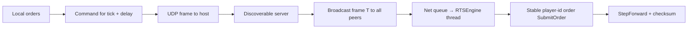

# Deterministic lockstep networking

Living plan. Lock the model and module boundaries first. Payload layout, VPS vendor, and P2P are experiments — not blockers for the first slice.

## Problem

SimRTS is a local deterministic tick sim (`TickEngine`) with Unreal as display/input. There is no net stack. Unreal replication of unit actors is the wrong granularity. Steam/EOS/Unreal NetDriver would lock transport to a supplier.

We need a **hosting-environment** stack: our process on a machine we control, our bytes on the wire, our lockstep clock.

## What we know

- **Sync model:** deterministic lockstep. Same initial `BattleState` + same commands on the same tick, applied in the same order → same state. We send **commands**, not unit positions.
- **MTU:** every sync message must fit in a **single MTU**. No IP fragmentation for lockstep frames. Target a conservative payload budget (~1200 bytes usable), not the 1500 Ethernet headline.
- **Vendor agnostic:** no Unreal networking, no Steam, no EOS. Transport is OS sockets + HTTP. Unreal may call into the Net module; the Net module must not include Unreal types.
- **Transports the Net module must have:**
  - **UDP** — lockstep frames (and later P2P/relay)
  - **TCP** — reliable control where UDP is the wrong tool
  - **HTTP** — matchmaking / session discover (simple requests, not a web app)
- **Thread rule:** the Communication Server (sockets, recv) is **not** the sim. Inbound messages are queued, then **pumped on the RTSEngine thread** so they cannot race `StepForward` / `SubmitOrder`.
- **Permanent discoverable server** always exists, for:
  - matchmaking (who is in this session, how to join)
  - relay (clients talk to the host when P2P is absent or fails)
  - later: assist P2P (introduce mapped addresses / TURN-like relay on the same box)

## Architecture

Three processes/roles. Same lockstep protocol. Hosting is replaceable (LAN box, VPS, Docker).

```text
[SimRTS client]                    [Discoverable host]
 Unreal display/input               Matchmaking HTTP
 Net module (UDP/TCP/HTTP)  <---->  Relay / session
        |                           Optional: run TickEngine
        v                           or only order frames
 RTSEngine thread
  pump commands → SubmitOrder
  wait for frame T from all players
  StepForward → checksum
```



### Module split

| Piece | Lives in | Must not |
|---|---|---|
| `TickEngine`, `Order`, `BattleState` | **RTSEngine** (unchanged contract) | sockets, HTTP, Unreal |
| Sockets, HTTP client, recv threads, frame codec | **Net** (new, STL/OS only) | Unreal, Steam, EOS |
| Display, selection, PIE wiring, pump Net → bridge | **SimRTS** | own a second sim clock |

The discoverable server is a **small native binary** (Net + optionally RTSEngine). It is not an Unreal dedicated server.

### Clock

Stop treating `ASimRTSGameMode`'s local timer as the authority in a session.

For tick `T`: collect every player's command list (**empty is valid**), apply in **stable player-id order**, `StepForward`, hash. Offline: delay 0, one local player, same code path.

A client missing that full set is **locked** (`GetTick()` does not advance). It must still emit AT-cadence frames so it does not stall the room: [`altruistic_locking.plan.md`](altruistic_locking.plan.md).

### Threading

- Socket threads: recv, checksum of bytes, push into a lock-free / mutex queue.
- RTSEngine thread (Unreal game thread today): pop frames whose `execute_tick == current`, submit, step.
- Never call `SubmitOrder` / `StepForward` from a recv callback.

## What we send (intent, not frozen layout)

Lockstep payload is **player commands for a tick**, plus enough to detect desync.

Likely contents (to experiment, not specify yet):

- session / protocol version
- `player_id`
- `execute_tick`
- zero or more `Order`s (unit ids, type, target, `is_next`)
- checksum of `BattleState` at some cadence (not necessarily every tick)

Hard constraint: **one UDP datagram, one MTU**. If a multi-unit order list would exceed the budget, that is a protocol/design problem to solve in the experiment (split by tick, cap selection size, compress ids) — not by fragmenting.

TCP/HTTP are **not** the lockstep hot path. HTTP: create/join session, list host address. TCP: optional reliable control (join handshake, kick, debug dump).

## Permanent discoverable server

Always-on, public address (VPS later; localhost for PIE).

| Role | Now | Later |
|---|---|---|
| Matchmaking | HTTP: create/join, return session id + host endpoint | ranked/lobby polish |
| Relay | All lockstep UDP through this process | still fallback when P2P fails |
| P2P assist | not in first slice | introduce candidates; TURN-like relay on the same host |

v1 is **client–server relay**, not ICE. Clients open **outbound** UDP/TCP/HTTP to the discoverable host. That works through typical home NAT without STUN.

## What we do not know yet

### VPS vendor

Need a box that is: reachable, low ping for the players we care about, cheap bandwidth (lockstep should be tiny), easy SSH/Docker. **Not blocking** the Net module or local PIE host. Revisit when we want a public session.

Candidates to compare later (not a choice yet): Hetzner, DigitalOcean, OVH, a regional provider near the team.

### Exact wire bytes

We know we send **commands + tick + identity + checksums**, not replicated actors. Encoding, field order, checksum interval, empty-frame cadence, and reliability (pure UDP vs simple ack/resend of frames) need a **payload experiment** before freezing.

### When to do true P2P

Not the first slice. Add when relay latency or VPS bandwidth actually hurts. The discoverable host stays: matchmaking + ICE/TURN assist. Prefer **libjuice + coturn on our host** over WebRTC-in-Unreal if that day comes. pion only if the host process is Go.

## First slice (implementation order)

1. Net module: UDP bind/send, TCP listen/connect, HTTP GET/POST helper. No Unreal.
2. Command-frame sketch + MTU assert in tests (reject / fail loud if over budget).
3. Recv queue + pump API for the sim thread.
4. Discoverable host binary: HTTP matchmaking stub + UDP relay of opaque frames (can start as echo/broadcast).
5. SimRTS: replace immediate `SubmitMoveOrder` with “queue for `tick + delay`”; pump relayed frames into `FSimBridge` on `OnSimTick`.
6. Checksum log; halt on mismatch.
7. Offline delay 0 so current PIE still plays.

## Out of scope / rejected for v1

- Unreal actor replication, NetDriver, Steam sockets, EOS
- ICE/STUN/TURN, libnice, WebRTC in the game
- Dedicated Unreal server target
- Rewind / rollback (GGPO). Lockstep waits; RTS command delay is the lag model
- Encrypt/auth production hardening (add once frames work; still our certs, not a platform identity)

## References

- [1500 Archers on a 28.8](https://www.gamedeveloper.com/programming/1500-archers-on-a-28-8-network-programming-in-age-of-empires-and-beyond) — RTS lockstep
- [Deterministic Lockstep (Gaffer)](https://gafferongames.com/post/deterministic_lockstep/) — why input, not state
- Sim determinism notes: [`DeterministicMath/overview.md`](../DeterministicMath/overview.md)
- Engine: [`TickEngine.h`](../SimRTS/Source/RTSEngine/Public/TickEngine.h), [`Order.h`](../SimRTS/Source/RTSEngine/Public/Order.h)
