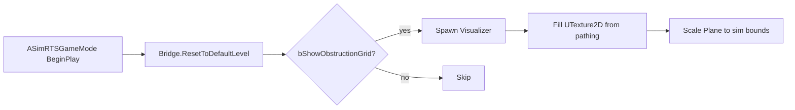

# Obstruction-distance grid texture overlay

## Approach

One `ASimRTSObstructionGridVisualizer` actor: build a `width × height` `UTexture2D` from `pathing.At(x,y).obstruction_distance`, map onto a single BasicShapes Plane sized to the sim world. No per-cell actors. Pure SimRTS visualization; RTSEngine unchanged.

## Color mapping

- `t = clamp(obstruction_distance / MaxBlueDistance, 0, 1)` with `MaxBlueDistance = 30`
- RGB = lerp `(1,0,0)` → `(0,0,1)` by `t`
- Blocked / distance `0` → full red; `≥30` (and open-map sentinel) → full blue
- Translucent alpha ~0.5 so units stay visible

## Files to add

- [`SimRTS/Source/SimRTS/Debug/SimRTSObstructionGridVisualizer.h`](SimRTS/Source/SimRTS/Debug/SimRTSObstructionGridVisualizer.h)
- [`SimRTS/Source/SimRTS/Debug/SimRTSObstructionGridVisualizer.cpp`](SimRTS/Source/SimRTS/Debug/SimRTSObstructionGridVisualizer.cpp)
- Content material [`SimRTS/Content/Debug/M_ObstructionGrid`](SimRTS/Content/Debug/M_ObstructionGrid) (Unlit, Translucent, Texture param `GridTexture`, Opacity from texture A or constant, **Nearest** filtering so cells stay sharp)

## Files to edit

- [`SimRTS/Source/SimRTS/SimRTS.Build.cs`](SimRTS/Source/SimRTS/SimRTS.Build.cs) — add `Debug` to `PublicIncludePaths`
- [`SimRTS/Source/SimRTS/Framework/SimRTSGameMode.h`](SimRTS/Source/SimRTS/Framework/SimRTSGameMode.h) / [`.cpp`](SimRTS/Source/SimRTS/Framework/SimRTSGameMode.cpp):
  - `UPROPERTY(EditDefaultsOnly) bool bShowObstructionGrid = false`
  - `UPROPERTY(EditDefaultsOnly, meta=(ClampMin=1)) int32 ObstructionGridMaxBlueDistance = 30`
  - After successful `Bridge.ResetToDefaultLevel()`, if flag set: `GetWorld()->SpawnActor<ASimRTSObstructionGridVisualizer>` then `Build(Bridge.GetStaticData().pathing, GridScale, MaxBlueDistance)`
  - Hold `TObjectPtr` and destroy in `EndPlay`

Reuse existing centering from [`GridToWorld`](SimRTS/Source/SimRTS/Framework/SimRTSGameMode.cpp): plane center `(0,0,ZOffset)`, scale so plane’s 100 UU extent maps to `(width * GridScale) × (height * GridScale)`.

## Visualizer implementation steps

1. **Actor setup** — `UStaticMeshComponent` → `/Engine/BasicShapes/Plane`; `NoCollision`; no shadows; Z ≈ `1` to avoid floor z-fight.
2. **`Build(const PathingGrid&, float GridScale, int32 MaxBlueDistance)`**
   - Create `UTexture2D` (`PF_B8G8R8A8`, no mipmaps, `TF_Nearest`)
   - Lock/bulk write one pixel per cell: `Pixel[y*W+x]` from `obstruction_distance`
   - `UpdateResource()`
   - Soft-load `M_ObstructionGrid`, `CreateDynamicMaterialInstance`, set `GridTexture`, assign to plane
   - Set actor location/scale to sim bounds only
3. **Toggle** — flag off → never spawn; rebuild not needed mid-battle (pathing is static after load)

## Material (one-time Content)

In Editor: Material `M_ObstructionGrid` under `Content/Debug/`:
- Blend: Translucent; Shading: Unlit
- Sample `GridTexture` → Emissive/Base Color; Alpha → Opacity (~0.5 or texture A)
- Sampler: Nearest / no mips

## Verify

- Flag false: no overlay, unchanged gameplay/clicks
- Flag true: colored grid only over sim area; red at blocked cells; blue by ~30; units still selectable above it
