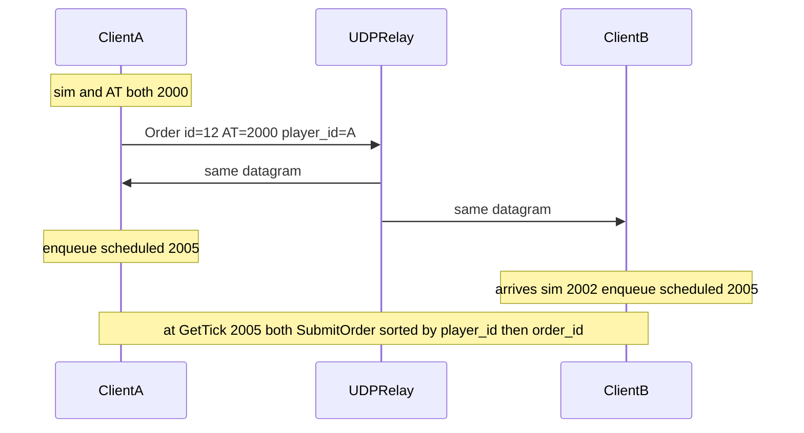

# Optimistic scheduled orders (Future Tick Distance)

FTD management stays an open question. This slice hardcodes it in [`Networking.json`](../SimRTS/Content/Data/Networking.json) as **`future_tick_distance`: 5** (~167 ms at 30 tps). Same JSON on every client. Relay stays dumb: extra fields ride in the existing UDP Order body.

Optimistic: no empty frames, no wait-for-all, no checksum, no resend. If one-way lag stays under ~FTD ticks, both sims activate the same command on the same tick.

## Concepts

- **Actual Tick (AT)** — wall lattice from Kickoff `T0`: `floor((now - T0) * tps)`. Not `GetTick()` (that lags during zoom). Stamped once by the originator at click time.
- **Future Tick Distance (FTD)** — ticks from AT until the command may affect the sim. JSON integer, required, `>= 1`.
- **Scheduled Tick** — `AT + FTD`. Not sent on the wire; every client computes it from the packet’s AT and local FTD.

Pathfind must run at Scheduled Tick from that tick’s `BattleState`. Caching already-planned waypoints at click time would desync if clients pathfind on different ticks.

## Packet (Comms + encode)

Every lockstep order must name **who issued it**. Sort at Scheduled Tick is `player_id` then `order_id`. Receivers must use the **originator** id from the packet, never the local session.

Already on the wire today:

- UDP **header** `player_id` — matchmaking string; relay uses it to seat/broadcast. Keep it.
- Order **body** `sim_player_id` — hashed int for [`Order.player_id`](../SimRTS/Source/RTSEngine/Public/Order.h). Keep it; this is the engine sort key.

Do not add a second string copy in the body. Do stamp `sim_player_id` from the originator on send (`SimPlayerIdFromLogin` of the sender). On bounce, enqueue with that packet field (already done for immediate apply). Header string can be hashed on receive as a check later; not required this slice.

Add to [`CommsOrder`](../SimRTS/Source/RTSComms/Public/CommsTypes.h) and UDP Order body (still one MTU):

- `sim_player_id` (int32, originator — already present)
- `order_id` (uint32, per-sender increment in GameMode)
- `actual_tick` (int32)

[`RTSServer`](../RTSServer/udp.go) does not parse the body. No Go change. [`udp_test.go`](../RTSServer/udp_test.go) only checks the header.

## Engine cache

[`TickEngine`](../SimRTS/Source/RTSEngine/Public/TickEngine.h): a scheduled-command list, **not** `BattleState.orders` (those stay waypoint segments).

- `SubmitScheduled(Order, order_id, scheduled_tick)` — raw order, no pathfind. Dedupe `(player_id, order_id)`.
- Keep `SubmitOrder` immediate for [`simrts_smoke_test.cpp`](../tools/simrts_smoke_test.cpp).
- Start of `StepForward`, before `ApplyOrders`: take all cached commands with `scheduled_tick <= tick_`, sort by `player_id` then `order_id`, `SubmitOrder` each (pathfind now), drop them.

Late packet (`scheduled_tick` already past): still activates this step. That is the optimistic failure (desync). No recovery. Optional `UE_LOG` on the SimRTS side if `scheduled_tick < GetTick()` at enqueue.

## SimRTS wiring

Send on click immediately ([`immediate_sends.plan.md`](immediate_sends.plan.md)). Apply only from the bounce, into the cache — originator does not `SubmitOrder` locally on click.

**Delete `mock_tick_lag` entirely.** It delayed send; FTD delays activate. Do not keep the JSON key, a fallback, or a unused GameMode field.

- [`Networking.json`](../SimRTS/Content/Data/Networking.json) / [`NetworkingLoader`](../SimRTS/Source/SimRTS/Level/NetworkingLoader.h): remove `mock_tick_lag`; required `future_tick_distance` `>= 1`.
- [`ASimRTSGameMode`](../SimRTS/Source/SimRTS/Framework/SimRTSGameMode.h): remove `MockTickLag`, `FDelayedMoveOrder`, `DelayedMoveOrders`, `FlushDelayedMoveOrders`. [`OnSimTick`](../SimRTS/Source/SimRTS/Room/SimRTSRoom.cpp) no longer flushes delayed sends.
- [`USimRTSRoom::GetActualTick()`](../SimRTS/Source/SimRTS/Room/SimRTSRoom.h) from `T0` + `FPlatformTime::Seconds()`.
- [`ASimRTSGameMode::SubmitMoveOrder`](../SimRTS/Source/SimRTS/Framework/SimRTSGameMode.cpp): `SendOrder` with originator `sim_player_id`, `actual_tick = GetActualTick()`, incrementing `order_id`.
- Bounce handler: `scheduled = actual_tick + FTD`, `GetEngine().SubmitScheduled(...)`.
- [`FSimBridge`](../SimRTS/Source/SimRTS/Bridge/SimBridge.h): expose `SubmitScheduled` (or GameMode calls `GetEngine()`).
- [`Project.md`](../Project.md) and any other docs that mention `mock_tick_lag`.

Clock not started → do not send (already requires a loaded room).

## Docs / HUD

[`Project.md`](../Project.md): FTD, AT, scheduled tick; no `mock_tick_lag`. HUD: optional Actual Tick next to sim Tick (cheap debug).

Out of scope: hashes, resend, empty frames, wait-for-all, FTD auto-tuning, RTSServer behavior, `TickEngine` math. Wait-for-all send-while-stalled is [`altruistic_locking.plan.md`](altruistic_locking.plan.md).
