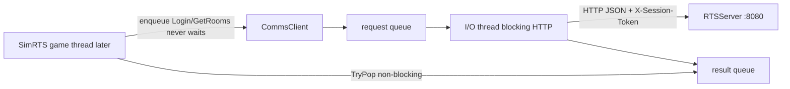

# RTSComms HTTP client module

New Runtime module next to RTSEngine. It is the client API layer for [`RTSServer`](../RTSServer/) (local `http://127.0.0.1:8080`). SimRTS will call it later; this slice only adds the module and makes UBT build it.

SimRTS must stay **block-free**: never wait on sockets, HTTP, or the I/O thread. Enqueue + `TryPop` only. Documented in [`Project.md`](../Project.md).



## Constraints (locked)

- Comms `.h`/`.cpp`: STL + a **private TCP shim** ([`CommsSockets.h`](../SimRTS/Source/RTSComms/Private/CommsSockets.h): `#ifdef _WIN32` WinSock, else POSIX). That is the only file that knows the OS socket API. HTTP, JSON, and the I/O thread call `TcpConnect` / `TcpSend` / `TcpRecv` / `TcpClose` only. No `UObject`, no Unreal `HTTP`/`Json`.
- Module glue may depend on `Core` (same as [`RTSEngine.Build.cs`](../SimRTS/Source/RTSEngine/RTSEngine.Build.cs): `PCHUsage = NoPCHs`).
- **Public API never blocks.** `Login` / `GetRooms` / … enqueue and return immediately. Completions via non-blocking `TryPop` (SimRTS later pumps this on the game thread).
- Internally, **one `std::thread` I/O worker** may block on TCP/HTTP. That wait is not visible to SimRTS. Not async sockets; not Unreal `FRunnable`.
- No retries, reauth, TLS, or UDP. No callbacks from the I/O thread (unsafe for Unreal later).
- Session **token, player id, nickname** stored on `CommsClient` after a successful Login (worker updates, getters mutex-protected). Join/Leave send only room `id` (token attached on the worker).
- **No** [`SimRTS.Build.cs`](../SimRTS/Source/SimRTS/SimRTS.Build.cs) dependency in this slice (no gameplay wiring).

## Unreal wiring (required so the module actually compiles)

- [`SimRTS.uproject`](../SimRTS/SimRTS.uproject): add Runtime module `RTSComms`
- [`SimRTS.Target.cs`](../SimRTS/Source/SimRTS.Target.cs) and [`SimRTSEditor.Target.cs`](../SimRTS/Source/SimRTSEditor.Target.cs): `ExtraModuleNames.Add("RTSComms")`

## Files

```text
SimRTS/Source/RTSComms/RTSComms.Build.cs
SimRTS/Source/RTSComms/Public/RTSCommsAPI.h
SimRTS/Source/RTSComms/Public/CommsTypes.h
SimRTS/Source/RTSComms/Public/CommsClient.h
SimRTS/Source/RTSComms/Private/CommsSockets.h
SimRTS/Source/RTSComms/Private/CommsClient.cpp
SimRTS/Source/RTSComms/Private/RTSCommsModule.cpp
```

## Client API (non-blocking)

Default host `127.0.0.1:8080`.

Enqueue (return immediately): `Login`, `GetRooms`, `CreateRoom`, `JoinRoom`, `LeaveRoom`.

Pump: `TryPop(CommsEvent&)` — never waits for the network.

Desktop: Windows + Mac via the socket shim. Not Linux/consoles/mobile.

## Out of scope

- SimRTS GameMode / HUD / calling the client
- Unreal `FHttpModule` / `FSocket`
- Retries, token refresh, UDP, libcurl
