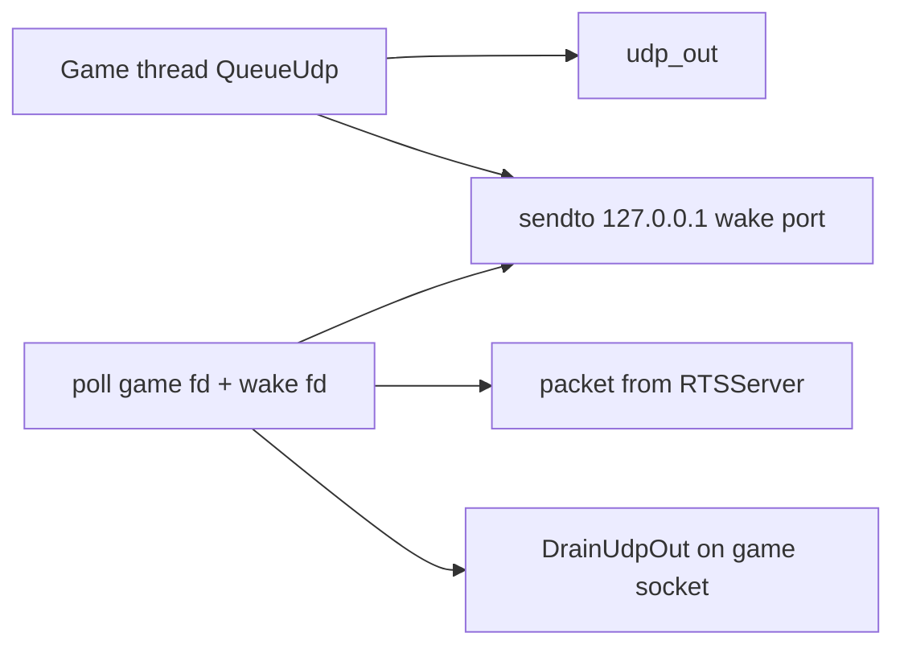

# Socket immediate send (loopback wake)

Living Comms contract. How [`CommsClient`](../SimRTS/Source/RTSComms/Private/CommsClient.cpp) puts a datagram on the wire without waiting for inbound UDP.

Click-vs-pacer (do not batch until `StepForward`) is [`immediate_sends.plan.md`](immediate_sends.plan.md). This file is the **socket** recipe.

Helpers: [`CommsSockets.h`](../SimRTS/Source/RTSComms/Private/CommsSockets.h) (`UdpWakeOpen` / `UdpWakeNotify` / `UdpPollWait`). Loop: `UdpLoop` `poll`s, then `DrainUdpOut`.

## The problem

One I/O thread both **sends** Orders and **receives** bounce / Ping / Kickoff. A blocking `recvfrom` on the game socket sleeps until a packet arrives (or an old `SO_RCVTIMEO`). Outbound bytes sitting in `udp_out` do not wake that sleep. Clicks waited on recv — tens of milliseconds on a quiet localhost — while Ping/Pong RTT still read 0 ms (Ping is stamped and drained on the I/O thread, not from the game-thread queue).

The game thread must stay block-free: encode, short mutex push, return. It must not `recvfrom`. It should not `sendto` on the relay socket unless we later choose that model; today send stays on I/O.

## One relay socket

RTSServer seats the player by the UDP **from** address on Hello. Kickoff, Pong, and Order bounce go back to **that** port. Send and recv toward `:8081` must share **one** socket (`udp_socket`, `UdpOpenBind`, `INADDR_ANY` ephemeral).

A second socket **to the host** would be a second ephemeral port. The room would not see clicks from it. Do not split relay send/recv across two public sockets.

## Loopback wake (the doorbell)

A **second** UDP socket exists only as a local alarm clock:

- Bind `127.0.0.1:0`. Never `sendto` the RTSServer address.
- `QueueUdp` (and `Stop`) sends **one dummy byte to itself** on that port (`UdpWakeNotify`).
- `poll` / `WSAPoll` waits on **both** fds: game socket **and** wake socket (`UdpPollWait`). Timeout still exists for ping cadence (~50 ms), not as a send gate.
- If the wake fd is readable, `UdpWakeDrain` throws the dummy away. Then `DrainUdpOut` `sendto`s real packets on the **game** socket.

Why a UDP loopback socket instead of a POSIX pipe: Windows `WSAPoll` waits on `SOCKET`s. A loopback datagram is the same idea on Mac and Win64.

`poll` returning because of the wake is not “interrupt a half-read UDP packet.” Inbound `recvfrom` still returns one whole datagram or nothing. Drain the wake, then recv the game socket if it is also ready (level-triggered loop until `EAGAIN`).

## What this is not

| Idea | Why not |
|---|---|
| Stop recv to send faster | Miss bounce, ping, kickoff. |
| Two sockets to the relay | Breaks Hello seating. |
| Wake by `close` / `closesocket` | Can drop datagrams still in the kernel buffer. |
| Dummy UDP to the **game** socket | Easy to confuse with `RTS1`. Keep wake on its own fd. |
| Treating Ping RTT as click-to-wire delay | Different clocks; see above. |

Game-thread non-blocking `sendto` on the **same** relay socket is a valid alternative (POSIX and Winsock allow send+recv on two threads). We did not take it: all `sendto`/`recvfrom` on the relay fd stay on I/O; the wake only unblocks `poll`.

## Out of scope here

- Pacer / FTD / when the sim applies the order ([`immediate_sends.plan.md`](immediate_sends.plan.md)).
- Empty lockstep frames / altruistic locking.
- Changing RTSServer.
