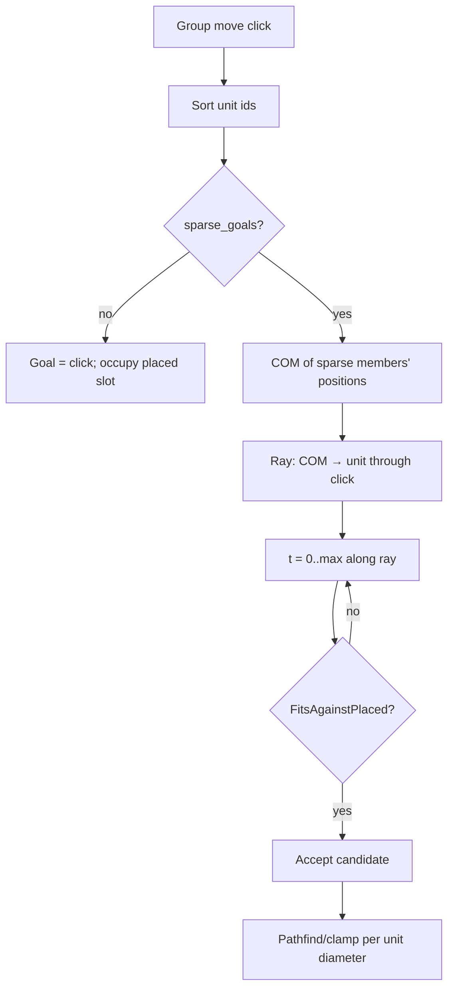

# Formation-preserving sparse goals

## Problem

A group move with one click sent every unit to the same cell. Units stacked on arrival and needed a soft separation pass. Sparse goals should keep relative formation (who was left/right of the group) without hand-authored slots.

## Approach

When `SubmitOrder` applies a multi-unit move:

1. Sort/dedupe `unit_ids` (deterministic).
2. Split members into **sparse** (`UnitDef.sparse_goals`) and **non-sparse**.
3. Non-sparse units keep the raw click and seed `initially_placed` with their diameters so sparse expansion respects them.
4. `FormationSparseGoals` places sparse members by ascending unit id (not largest-first).
5. Each unit still pathfinds from its start to its own goal (`EnqueuePathForUnit` + diameter clearance).

## Placement rules

- **COM** from current positions of sparse members only.
- **Direction** = normalize(`unit.pos - COM`). Stacked on COM → deterministic ring angle by id-rank.
- **Candidate** = clamp(`click + round(dir * t)`) to world bounds.
- **Accept** when pairwise discs do not overlap already-placed slots:
  - Overlap when `4 * (dx² + dy²) < (diameter_a + diameter_b)²`
- **Walls ignored** here — no `FitsDiameter` / `obstruction_distance`. Path clamp builds legal segments; idle push spreads units that clump near obstacles.
- Ray cap: `max(world_w, world_h) + 1`. Exhausted ray → keep click (still record slot for later units).

## Flags / data

- [`UnitDef.h`](SimRTS/Source/RTSEngine/Public/UnitDef.h): `bool sparse_goals = true`
- [`GameRules.json`](SimRTS/Content/Data/GameRules.json): optional `"sparse_goals": true|false` per `unit_defs` entry
- Missing def / missing key → treat as on

## Files

- Edit: [`TickEngine.cpp`](SimRTS/Source/RTSEngine/Private/TickEngine.cpp) — `FormationSparseGoals`, `SubmitOrder` wiring
- Edit: [`TickEngine.h`](SimRTS/Source/RTSEngine/Public/TickEngine.h) — comment on multi-unit sparse behavior
- Edit: [`UnitDef.h`](SimRTS/Source/RTSEngine/Public/UnitDef.h), level/JSON loader for the flag
- Smoke: [`tools/simrts_smoke_test.cpp`](tools/simrts_smoke_test.cpp)

## Out of scope / rejected

- Mid-move `move_push` (caused stuck units / broken sparse arrival) — removed; idle push only after settle.
- Wall-aware sparse skipping (pushed goals around large obstacles) — removed by design.

## Verify

- Two soldiers left/right of COM → distinct goals preserving left/right order
- Pairwise goals respect diameters
- Single-unit move still uses raw click
- `sparse_goals: false` unit keeps click; sparse peers expand around it
- Goals may sit near walls; path segments stay clear; idle push separates overlaps after arrival
