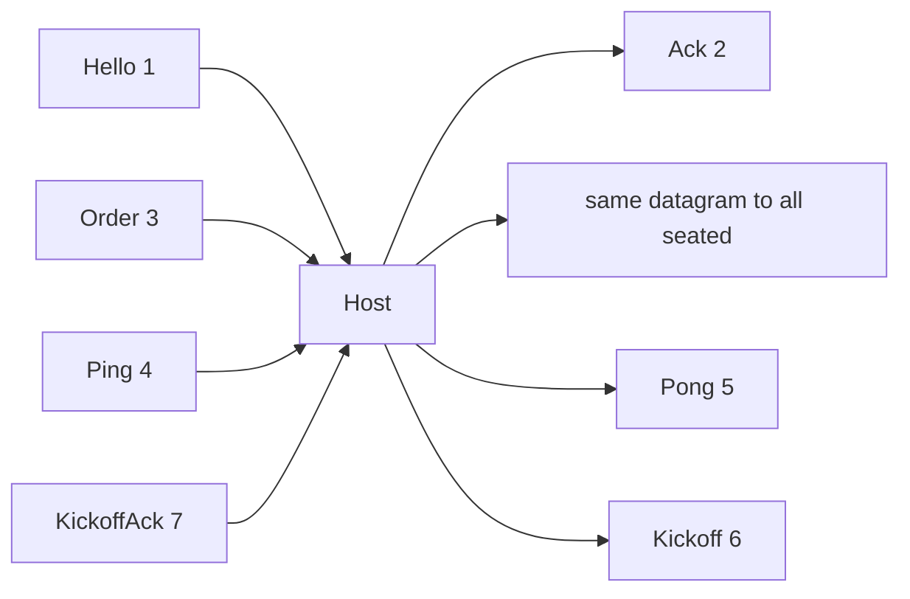

# UDP packets (current wire)

Living inventory. Encode: [`CommsClient.cpp`](../SimRTS/Source/RTSComms/Private/CommsClient.cpp). Host parse/relay: [`udp.go`](../RTSServer/udp.go). Integers: [`endian_independent.plan.md`](endian_independent.plan.md).

This file does **not** specify ACK packets. Empty `order_id` reuse and gap fill: [`retroactive_empties.plan.md`](retroactive_empties.plan.md). Leftover datagram space is still unused.

## Caps

| Name | Value | Meaning |
|---|---|---|
| App cap | **1200** bytes | `kUdpMaxPacket` / `udpMaxPacket`. Encode fails if larger. Host read buffer is this size. |
| Id string | **1–64** bytes | Length-prefixed (`u8` length + bytes). Room id, login `player_id`, Hello token. |
| Unit ids on Order | **0–64** | `u16` count, then `i32` each. |

1200 is **not** ethernet MTU (1500). IPv4+UDP headers are ~28 bytes, so a 1200-byte payload still fits a normal LAN frame. Do not grow past 1200 without raising both C++ and Go.

## Shared header (every kind)

Little-endian. Strings: `u8 length` then that many bytes (ASCII ids).

| Offset / order | Field | Size |
|---|---|---|
| 0 | magic `RTS1` | 4 |
| 4 | kind | 1 |
| 5 | `room_id` | 1 + N (N ≤ 64) |
| | `player_id` | 1 + M (M ≤ 64) |
| Hello only | session token | 1 + T (T ≤ 64) |

Typical LAN sizes used below: room `"room"` (4), login id `"p_"` + 16 hex chars (**18**). Header without token = **4+1+5+19 = 29** bytes. Kickoff writes `player_id` as empty string (length 0).

`player_id` in the header is the **login** id (`p_…`). Order body also has `sim_player_id` (FNV hash of that string, `i32`).

## Kinds

### 1 Hello — client → host

Seats the UDP `from` address. Join is not complete until Ack.

| Field | Size |
|---|---|
| header + token | 29 + 1+64 = **94** typical (token is 64 hex chars) |

Host parses token, looks up session, `Seat`, replies Ack. Not relayed.

### 2 Ack — host → that client

| Field | Size |
|---|---|
| header only (no token) | **29** typical |

No body. Completes Join.

### 3 Order — client → host → every seated address (including sender)

Host does **not** parse the body. Same bytes rebroadcast.

After the shared header:

| Field | Type | Size |
|---|---|---|
| `type` | u8 | 1 |
| `is_next` | u8 (0/1) | 1 |
| `target_x` | i32 | 4 |
| `target_y` | i32 | 4 |
| unit count | u16 | 2 |
| `unit_ids[i]` | i32 × count | 4 × count (0–64) |
| `sim_player_id` | i32 | 4 |
| `order_id` | u32 | 4 |
| `actual_tick` | i32 | 4 |
| `hash_tick` | i32 | 4 |
| `state_hash` | u64 | 8 |

Clicks increment `order_id`. Empties reuse the sender's last click id (0 before any click). Receivers fill missing Actual Ticks since that click when a consecutive click or same-id empty arrives ([`retroactive_empties.plan.md`](retroactive_empties.plan.md)).

Body with **0 units** (idle empty): **36** bytes. Full packet typical: **29 + 36 = 65**.

Body with N units: 36 + 4N. Cap N=64 → body 292, packet typical **321**.

| Variant | Typical total | Leftover to 1200 |
|---|---|---|
| Empty (30 Hz heartbeat) | ~65 | **~1135** |
| Click, 8 units | ~97 | ~1103 |
| Click, 64 units | ~321 | ~879 |

Empties are the interesting leftover: most of the datagram is unused every Actual Tick.

Clicks and empties share this layout (`count=0`, targets 0). Hash pair is always present ([`gameplay_state_hash.plan.md`](gameplay_state_hash.plan.md)).

### 4 Ping — client → host (not relayed)

| Field | Size |
|---|---|
| header + `seq` u32 | **33** typical |

After Join, on `ping_interval_ms`. Host echoes Pong to sender only.

### 5 Pong — host → that client

Same shape as Ping: header + `seq` u32. **33** typical. RTT on the I/O thread.

### 6 Kickoff — host → every seated address

Host-built. `player_id` string is **empty**.

| Field | Size |
|---|---|
| magic, kind, room, empty player, `kickoff_id` u32, `remaining_ms` u32 | **4+1+5+1+4+4 = 19** for room `"room"` |

Repeated until every seated KickoffAck or remaining hits 0. Not a command frame.

### 7 KickoffAck — client → host (not relayed)

| Field | Size |
|---|---|
| header + `kickoff_id` u32 | **33** typical |

## Who reads what

| Kind | Host | Client |
|---|---|---|
| Hello | token + seat `from` | — |
| Ack | — | Join complete |
| Order | header only; copy datagram | full body → lockstep / hash |
| Ping | `seq` | — |
| Pong | — | RTT |
| Kickoff | — | arm pacer |
| KickoffAck | `kickoff_id` | — |

HTTP login/rooms are JSON, not these kinds.

## Cadence (why leftover matters)

Orders already go out **every Actual Tick** (empty or click). Ping is occasional. Hello/Ack/Kickoff are lobby.

Any recovery that fits in the unused ~1100 bytes of an Order piggybacks on traffic that already exists. Extra ACK kinds would be new packets on the same lossy path.

## Out of this file

How to fill leftover (history, redundant empties, bitsets). New kinds. Raising 1200. Changing Hello/Ping/Kickoff. Engine `BattleState` layout.
