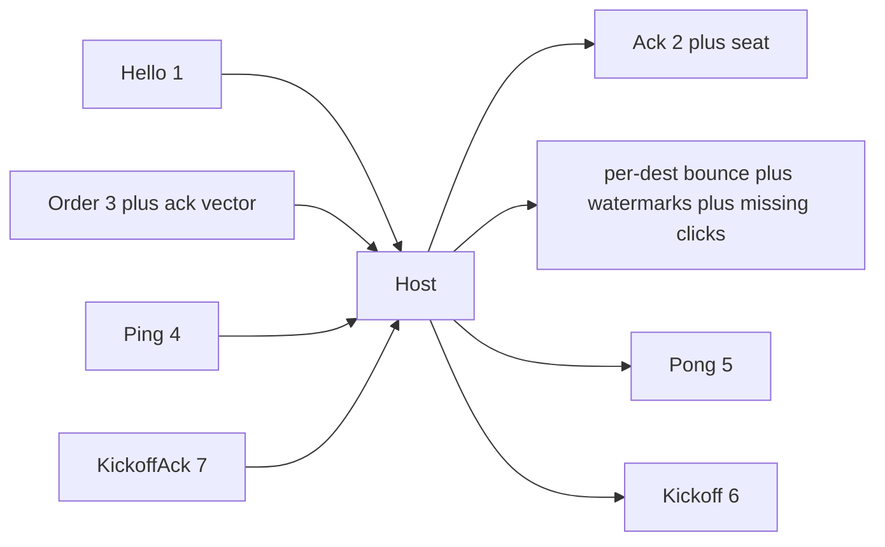

# UDP packets (current wire)

Living inventory. Encode: [`CommsClient.cpp`](../SimRTS/Source/RTSComms/Private/CommsClient.cpp). Host parse/bounce: [`udp.go`](../RTSServer/udp.go) / [`rooms.go`](../RTSServer/rooms.go). Integers: [`endian_independent.plan.md`](endian_independent.plan.md). Empty `order_id` reuse and gap fill: [`retroactive_empties.plan.md`](retroactive_empties.plan.md).

## Caps

| Name | Value | Meaning |
|---|---|---|
| App cap | **1200** bytes | `kUdpMaxPacket` / `udpMaxPacket`. Encode fails if larger. Host read buffer is this size. |
| Id string | **1–64** bytes | Length-prefixed (`u8` length + bytes). Room id, login `player_id`, Hello token. |
| Unit ids on Order | **0–64** | `u16` count, then `i32` each. |
| Seated players | **255** | Join-order `u8` seat (0–254). Never reused in that room. Ack/watermark count is `u8`. |

1200 is **not** ethernet MTU (1500). IPv4+UDP headers are ~28 bytes, so a 1200-byte payload still fits a normal LAN frame. Do not grow past 1200 without raising both C++ and Go.

## Shared header (every kind)

Little-endian. Strings: `u8 length` then that many bytes (ASCII ids).

| Offset / order | Field | Size |
|---|---|---|
| 0 | magic `RTS1` | 4 |
| 4 | kind | 1 |
| 5 | `room_id` | 1 + N (N ≤ 64) |
| | `player_id` | 1 + M (M ≤ 64) |
| Hello only | session token | 1 + T (T ≤ 64) |

Typical LAN sizes used below: room `"room"` (4), login id `"p_"` + 16 hex chars (**18**). Header without token = **4+1+5+19 = 29** bytes. Kickoff writes `player_id` as empty string (length 0).

`player_id` in the header is the **login** id (`p_…`) for host auth. Order **body** originator is a join-order `u8 seat` (engine `PlayerId`). Lobby JSON keeps `player_ids` plus aligned `seats`.

## Kinds

### 1 Hello — client → host

Seats the UDP `from` address. Join-order seat 0, 1, 2, … on first Hello. Join is not complete until Ack.

| Field | Size |
|---|---|
| header + token | 29 + 1+64 = **94** typical (token is 64 hex chars) |

Host parses token, looks up session, `Seat`, replies Ack with that seat. Not relayed.

### 2 Ack — host → that client

| Field | Size |
|---|---|
| header + `u8 seat` | **30** typical |

Completes Join. Client stores the local seat.

### 3 Order — client → host → per-recipient bounce (including sender)

Host **parses** the body. Bounce is rebuilt per dest: same command + sender ack vector, then dest watermarks, then missing **clicks** from the host cache (not empties). Same number of datagrams as a copy-relay.

After the shared header, a **command body**:

| Field | Type | Size |
|---|---|---|
| `type` | u8 | 1 |
| `is_next` | u8 (0/1) | 1 |
| `target_x` | i32 | 4 |
| `target_y` | i32 | 4 |
| unit count | u16 | 2 |
| `unit_ids[i]` | i32 × count | 4 × count (0–64) |
| `seat` | u8 | 1 |
| `order_id` | u32 | 4 |
| `actual_tick` | i32 | 4 |
| `hash_tick` | i32 | 4 |
| `state_hash` | u64 | 8 |

Then trailers (always present):

| Field | Type | Size |
|---|---|---|
| ack count | u8 | 1 |
| acks | (`u8 seat`, `u32 last_click_order_id`) × count | 5 × count |
| watermark count | u8 | 1 |
| watermarks | (`u8 seat`, `u32 fully_acked`) × count | 5 × count |
| piggyback count | u8 | 1 |
| piggybacks | command body × count | clicks only |

Client → host writes watermark count **0**, then any unacked local clicks that still fit. Host → dest writes fully-acked ids (min of every **other** seated player's reported last click for that originator) and piggybacks clicks that dest has not acked, as many as fit under 1200. Do not piggyback dest's own clicks or empties.

Ack vector is the full seated set. `last_click_order_id` is what this sender has **from that player** (retroactive fill counts; empties do not bump id). Two players ≈ 12 extra bytes for the ack list.

Clicks increment `order_id`. Empties reuse the sender's last click id (0 before any click). Receivers fill missing Actual Ticks since that click when a consecutive click or same-id empty arrives ([`retroactive_empties.plan.md`](retroactive_empties.plan.md)). Dropped clicks are recovered by host cache re-relay and originator resend on the next Order.

Command body with **0 units**: **33** bytes. Two-player empty client send: 29 + 33 + 11 + 1 + 1 = **75**. Bounce adds dest watermarks (11) instead of 0: **~85** plus any piggybacked click bodies.

Body with N units: 33 + 4N. Cap N=64 → command 289.

| Variant | Typical total (2 players, no piggyback) | Leftover to 1200 |
|---|---|---|
| Empty (30 Hz heartbeat) | ~75–85 | **~1115** |
| Click, 8 units | ~107–117 | ~1083 |
| Click, 64 units | ~331–341 | ~859 |

Clicks and empties share the command layout (`count=0`, targets 0). Hash pair is always present ([`gameplay_state_hash.plan.md`](gameplay_state_hash.plan.md)). Host click cache TTL is 10s; client keep window is `click_keep_ms` in [`Networking.json`](../SimRTS/Content/Data/Networking.json).

### 4 Ping — client → host (not relayed)

| Field | Size |
|---|---|
| header + `seq` u32 | **33** typical |

After Join, on `ping_interval_ms`. Host echoes Pong to sender only.

### 5 Pong — host → that client

Same shape as Ping: header + `seq` u32. **33** typical. RTT on the I/O thread.

### 6 Kickoff — host → every seated address

Host-built. `player_id` string is **empty**.

| Field | Size |
|---|---|
| magic, kind, room, empty player, `kickoff_id` u32, `remaining_ms` u32 | **4+1+5+1+4+4 = 19** for room `"room"` |

Repeated until every seated KickoffAck or remaining hits 0. Not a command frame.

### 7 KickoffAck — client → host (not relayed)

| Field | Size |
|---|---|
| header + `kickoff_id` u32 | **33** typical |

## Who reads what

| Kind | Host | Client |
|---|---|---|
| Hello | token + seat `from` | — |
| Ack | — | Join complete; store `u8 seat` |
| Order | command, ack vector, cache clicks; per-dest watermarks + piggybacks | lockstep / hash; local-seat watermark; piggyback clicks |
| Ping | `seq` | — |
| Pong | — | RTT |
| Kickoff | — | arm pacer |
| KickoffAck | `kickoff_id` | — |

HTTP login/rooms are JSON, not these kinds. Room JSON: `{ "id", "player_ids", "seats" }`.

## Cadence (why leftover matters)

Orders already go out **every Actual Tick** (empty or click). Click recovery rides on those datagrams. Ping is occasional. Hello/Ack/Kickoff are lobby.

## Out of this file

New kinds. Extra datagrams. Resending empties. Late join. ICE. Raising 1200. Engine `BattleState` layout.
