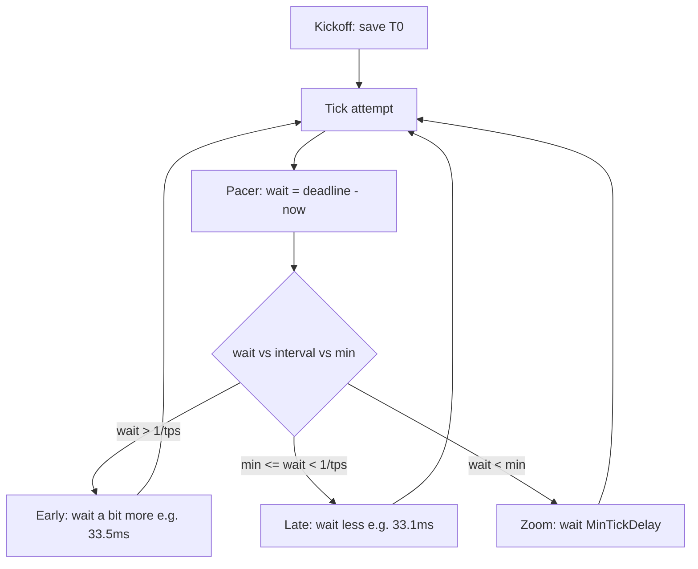

# Wall-clock pacer and zoom catch-up

Yes: this is a good next slice, and **yes, it belongs in the final lockstep solution**.

The pacer is **not** a frame loop and does not decide whether a tick happens. It only answers: **how long until the next attempt to tick?**

Today that attempt always ticks (`StepForward`). Lockstep later may no-op an attempt if command frames are missing. That is not the pacer’s job. A client that no-ops is **locked**; it must still send on the AT cadence — [`altruistic_locking.plan.md`](altruistic_locking.plan.md). Clicks must not wait for this timer — [`immediate_sends.plan.md`](immediate_sends.plan.md).

This slice is **Simulation only**. Do not change RTSEngine, RTSComms, or RTSServer.

## What the pacer does

Kickoff wait ends → save wall time `T0` (`FPlatformTime::Seconds()`). After each tick (and once at arm), compute:

```text
interval = 1 / ticks_per_second
wait     = (T0 + (GetTick() + 1) / tps) - now
```

Then wait that long before the next attempt. Compare `wait` to `interval` and `MinTickDelay` (default **10ms**):



- **Early** (`wait > 1/tps`): we got here before the next post. Wait the full computed time (33.5ms, not 33.3ms). No skip-frames.
- **Late** (`wait < 1/tps` but still at least min): wait less so the next attempt lands on the post.
- **Zoom** (`wait < MinTickDelay`, including negative): far behind. Wait `MinTickDelay` and attempt again, until waits return to ~1/tps.

Replace looping `SetTimer(1/tps)` in [`SimRTSRoom.cpp`](../SimRTS/Source/SimRTS/Room/SimRTSRoom.cpp) with a **one-shot** timer that reschedules using this `wait`. Do not block the game thread. Do not poll every Unreal frame and skip.

Time source: `FPlatformTime::Seconds()`, not dilated world time. First wait after arm is one interval (same as today).

## Implementation

[`USimRTSRoom::StartClock`](../SimRTS/Source/SimRTS/Room/SimRTSRoom.cpp): store `T0`, compute first wait, `SetTimer(..., false)`. Each `OnSimTick`: keep current body (flush, `StepForward`, sync), then compute next wait and one-shot again. [`Stop`](../SimRTS/Source/SimRTS/Room/SimRTSRoom.cpp): clear timer and `T0`.

`pacer_min_delay_ms` in [`Networking.json`](../SimRTS/Content/Data/Networking.json) (required, >= 1). GameMode loads it into seconds for the pacer.

Docs: [`Project.md`](../Project.md) currently says Unreal timer = `1 / ticks_per_second`. Change that to: Kickoff saves `T0`; the pacer waits until `T0 + N/tps` (or min delay when behind). Leave Kickoff wait as it is.

## Testing footnote (not pacer architecture)

`H` / `J` fake a hitch so zoom is easy to see. They are not a pacer state.

- GameMode `bEnableTickHaltKeys` (default **true**)
- [`ASimRTSPlayerController::SetupInputComponent`](../SimRTS/Source/SimRTS/Framework/SimRTSPlayerController.cpp): `H` halt, `J` resume. Ignore when the main menu is up, the clock is not running, or the toggle is off.
- While halted, do not `StepForward`; `T0` is unchanged so wall time keeps moving. On resume the next wait is below min → zoom. Same AT-vs-sim split as a locked client ([`altruistic_locking.plan.md`](altruistic_locking.plan.md)).
- HUD: `Halted` or `Catch-up: N` when still behind after a full `1/tps` (one tick of slack; a short next wait is not zoom)

How to test: Start a local room (~30 tps). `H` freezes tick/units. `J` fast-forwards until waits return to ~33ms. Toggle off: keys do nothing.

Out of scope: command frames, execute_tick, checksums, waiting on other players, RTSEngine math. The pacer must not delay UDP sends — [`immediate_sends.plan.md`](immediate_sends.plan.md).
